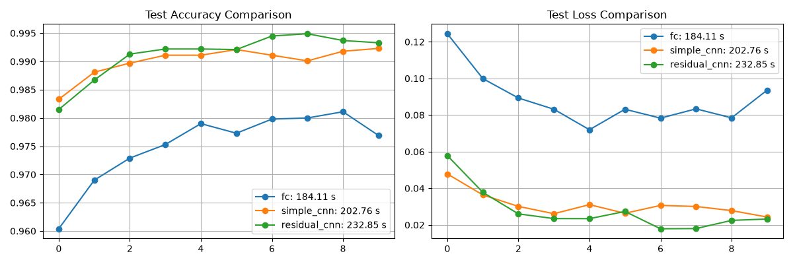
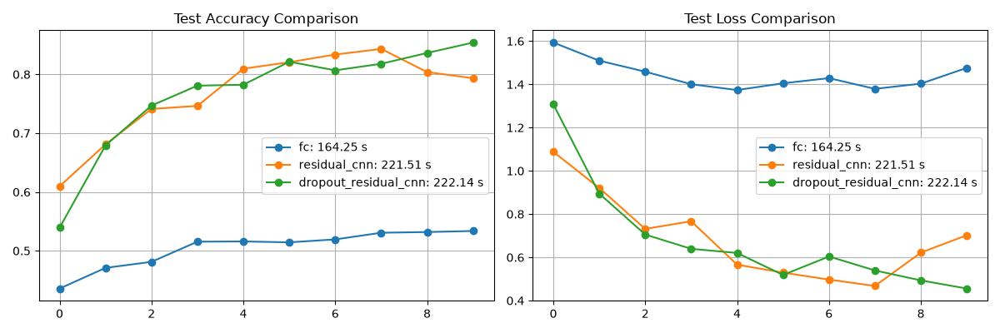
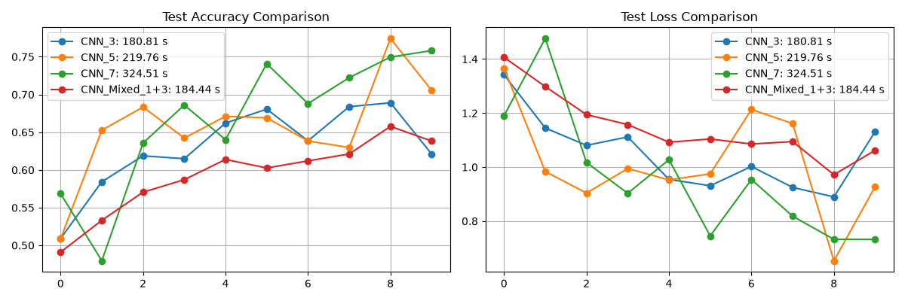
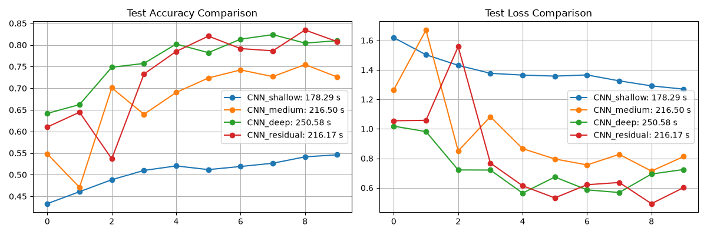
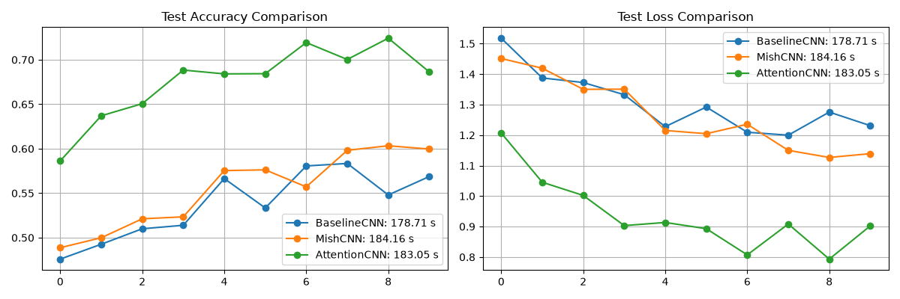
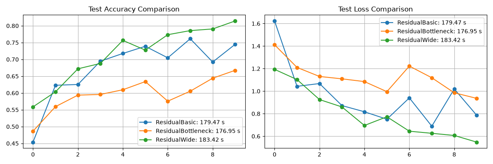

## Домашнее задание №4
### Выполнил: Анненков Арсений Алексеевич

## Задание 1: Сравнение CNN и полносвязных сетей
### 1.1 Сравнение на MNIST
|| Полносвязная сеть | Простая CNN | Residual CNN |
|---|---|---|---|
|Test Acc| 0.9769 | 0.9923 | 0.9933 |
|Train Acc| 0.9916 | 0.9961 | 0.9961 |
|Time| 184.11 | 202.76 | 232.85 |
|Parameters| 242762 | 421642 | 160906 |

При заметно меньшем времени обучения по сравнению с **Residual** простая **CNN** имеет схожую точность, однако количество параметров более чем в два раза больше, чем у **Residual**. Полносвязная сеть самая быстрая, но точность у неё ниже. 

### 1.2 Сравнение на CIFAR-10
|| Полносвязная сеть | Residual CNN | Residual CNN с регуляризвацией |
|---|---|---|---|
|Test Acc| 0.5337 | 0.7935 | 0.8541 |
|Train Acc| 0.64146 | 0.92698 | 0.9013 |
|Time| 164.25 | 221.51 | 222.14 |
|Parameters| 3837066 | 483530 | 483530 |

Как и в предыдущем варианте, время обучения у полносвязной модели значительно ниже, но также сильно падает. Добавление регуляризации в **CNN** заметно повышает точность, а время растёт незначительно.

## Задание 2: Анализ архитектур CNN
### 2.1 Влияние размера ядра свертки
|| CNN 3x3 | CNN 5x5 | CNN 7x7 | CNN 1x1 + 3x3 |
|---|---|---|---|---|
|Test Acc| 0.621 | 0.7054 | 0.7583 | 0.6383 |
|Train Acc| 0.79966 | 0.8385 | 0.85622 | 0.6383, |
|Time| 180.81 | 219.75 | 324.51 | 184.44 |
|Parameters| 224842 | 621130 | 1215562 | 98218 |

Лучшая точность у ядра с размерностью **7 на 7**, но при этом оно и самое затратное. Ядро **5 на 5** более компромиссный вариант, а смешанные ядра самые лёгкие из всех, время обучения у них то же, что и у ядра 3 на 3, но количество параметров значительно меньше.

По сравнению с другими ядрами видно, что у смешанного feature maps первого слоя более детальные.

### 2.2 Влияние глубины CNN
|| Неглубокий (2 слоя) | Средний (4 слоя) | Глубокий (6 слоёв) | CNN с Residual связями |
|---|---|---|---|---|
|Test Acc| 0.546 | 0.7259 | 0.8098 | 0.8077 |
|Train Acc| 0.56492 | 0.83406 | 0.96422 | 0.89926 |
|Time| 178.29 | 216.49 | 250.58 | 216.16 |
|Parameters| 20138 | 391466 | 1572138 | 483530 |

Точность у шести слоёв и **CNN с Residual** примерна одинаковая, однако у второго время обучения заметно меньше. Хуже всего себя показала **неглубокая CNN**, у неё очень низкая точность, но число параметров значительно меньше чем у остальных.

## Задание 3: Кастомные слои и эксперименты
### 3.1 Реализация кастомных слоев
|| Без кастомных слоёв | С фукнцией активации mish | Attention + Pooling |
|---|---|---|---|
|Test Acc| 0.5687 | 0.5996 | 0.6863 |
|Train Acc| 0.63512 | 0.63072 | 0.79338 |
|Time| 178.71 | 184.15 | 183.05 |
|Parameters| 77130 | 77130 | 141602 |

### 3.2 Эксперименты с Residual блоками
|| ResidualBasic | ResidualBottleneck | ResidualWide |
|---|---|---|---|
|Test Acc| 0.7448 | 0.6674 | 0.8143 |
|Train Acc| 0.85302 | 0.68744 | 0.83336 |
|Time| 179.47 | 176.95 | 183.42 |
|Parameters| 150474 | 11594 | 298186 |

Время у всех блоков примерно одинаково. У **Bottleneck Residual блока** в десятки раз меньшее количество параметров, но точность значительно ниже.
